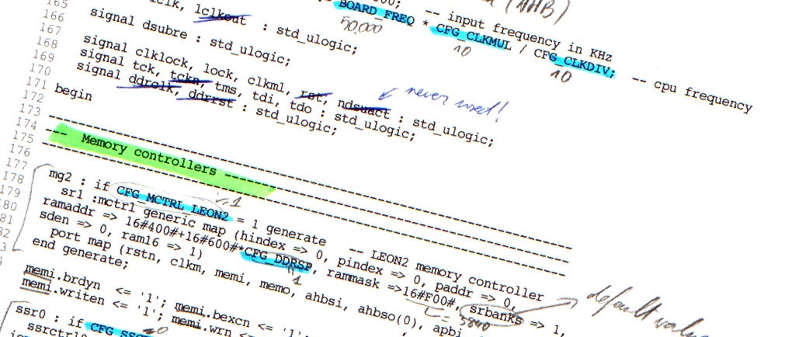

I recently found the correct word for something that has for years been an obvious tool for me: a <em>code comprehension tool</em>. A code comprehension tool, as you might guess helps you comprehend your code. All the smart work is still up to you, but your tool offers an overlay of extra information, much like the iPhone's <a href="http://www.commoncraft.com/augmented-reality-video">augmented reality</a> or a cockpit's head-up display ([why-hardware-designers-should-switch-eclipse]). Additionally, you get super navigation powers like <a href="http://www.youtube.com/watch?v=2PQi5ueqig4">Jumpers</a>.

A <a href="http://osteele.com/archives/2004/11/ides">recent article</a> about Tool Mavens vs Language Mavens made me realize that the term <em>code comprehension tool</em> is a good description for a part of what Sigasi offers to VHDL designers. 

So, every engineer should ask himself: am I still working through this code like a caveman? Or am I going to use the right tools for the job? (Screencast [/screencasts/vhdl_code_comprehension])

