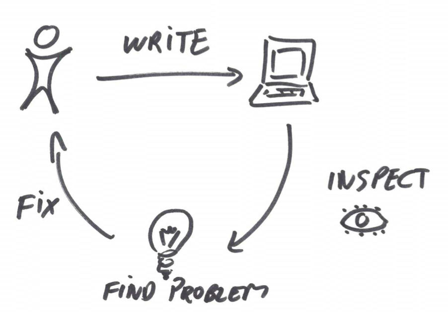
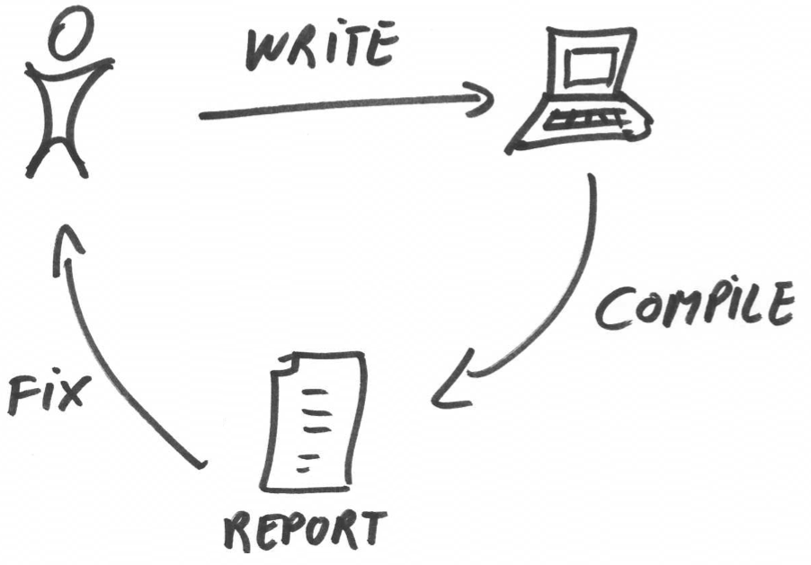

Sigasi Pro helps electronics engineers to create their hardware designs faster and with less errors. 

Writing VHDL is cumbersome and error prone. VHDL is extremely **verbose** (you need a lot of text to express even simple things) and **pedantic** (even small errors will cause compiler or run-time errors). These two characteristics unnecessarily add complexity to digital design. They raise the bar for junior engineers learning VHDL and they lock up mental energy of senior engineers working on large digital circuits.

Sigasi Pro takes the weight off your shoulders on those two fronts. Its differentiating features are:
* type-time error checking,
* tool-assisted quick-fixes,
* code snippet generation, based on the context.

## Dealing with VHDL's pedantry

VHDL's pedantic syntax checking and data type system were a design decision. The idea was that complaining early would reduce the risk of missiles going bananas in mid air. Remember that VHDL started as project of the US Department of Defense! Junior designers take many write / compile / fix iterations to get to code and senior designers lose precious time proofreading their code before hitting the compile button.

 

Sigasi's solution to writing correct data is to shorten the feedback loop. As soon as an engineer types a few characters, the ultra-fast built-in VHDL parser kicks in. Much like a spell checker in word processos, Sigasi marks errors in the code only seconds after they arise. We call this _type-time_ error checking.

The type-time compiler has to be very fast, so it does not perform a full analysis. In order to provide even more feedback about your code, Sigasi uses an external compiler for a full analysis. The external compiler is called as soon as you _save_ the file, which is still a lot sooner than with a traditional flow.

Watch this video about catching errors at type-time and save-time: [/screencasts/save_time_compilation]

## Dealing with VHDL's verbosity

VHDL needs a lot of words to express something. That doesn't mean that you have to type all of those words. As any decent editor, Sigasi comes with lots of templates for often-used constructs. Unlike other tools, Sigasi also generates code dynamically, based on the design context. With a few keystrokes, you can instantiate a component.

* *easily accessible templates*: just a few key strokes
* *dynamic templates* use your design to generate code snippets
* *quick-fixes*: fix common errors in two clicks

Watch "this short video about how to write a VHDL testbench":/screencast/create-testbench-sigasis-autocomplete-feature using static templates, dynamic templates for instantiations, and quick-fixes.

## Simply a great editor

In addition to these super advanced features, Sigasi's editor is simply great. Based on the industry standard Eclipse platform, Sigasi's editor includes all standard features:

* block select a.k.a. column mode editing \[[/screencasts/block_selection_mode]\], \[[/manual/user_interface#block-select]\]
* code folding \[[/manual/config#Folding]\]
* multi-screen support
* configurable key bindings
* and much more...

And some not-so-standard features:

* Quick diff shows differences between the text on screen and the file on disk
* Built-in local history to compare the file to the version of yesterday, 10:30.
* Integration with all major version control systems
* Bookmarks to keep track of line numbers in your files
* and more...
