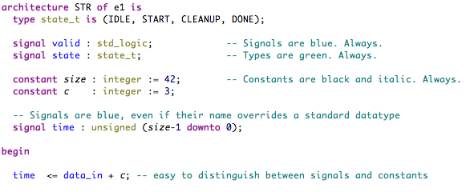

In my series of how Sigasi is [index], I want to talk about code coloring.

## Syntax Highlighting

Code coloring consists of two parts: syntax highlighting and semantic
highlighting. Most any editor does the former. The keywords are colored,
strings, numbers and comments all highlighted in a separate color. All of
this is possible using simple regular expressions (regex).

## Semantic Highlighting

Semantic highlighting is more difficult. Semantic highlighting means
that things get colored according to their <em>meaning</em>, not simply
according to their lexical class. Datatypes get a different color from
constants and signals get yet another color. In more advanced tools
(Eclipse JDT), the same variable will get a different color depending on
whether it is written or read. Of course, for any semantic highlighting
to work, you need to parse and analyse the file. Short configuration
files and regular expressions work great for syntax highlighting, but
they fail for semantic highlighting.

## Fakin’ It

The Emacs VHDL mode tries to mimic semantic highlighting, as do many general purpose editors. Datatypes
are given colored green, but only the <em>standard</em> datatypes. Any
datatype that you define yourself is treated as just another “name”.
Conversely, if you use the name of a standard datatype and you give a
new meaning to it, it will be colored green. Overriding standard names
like this is not a smart thing to do, but it is still legal.

I know some engineers who adhere to a coding convention in order to get
code coloring right. Signals end in `_s`, datatypes end in
`_t`. This is a workaround. It works fine in the controlled
environment of your own code. But it fails miserably when you have to
inspect or reuse somebody else’s code.

## Regex

The case of code coloring illustrates that regular expressions will not
cut it any more. This technology has been pushed to its limits in tools
like Emacs, with great results. But even the most skilled regular
expression wizard has to give up at a certain point, and we’ve reached
that point a while ago. In order to move forward and keep improving
features like code coloring, regex will no longer serve you well.
Built-in parsers are the answer.
