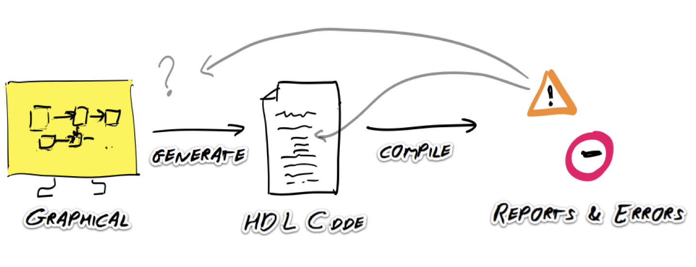
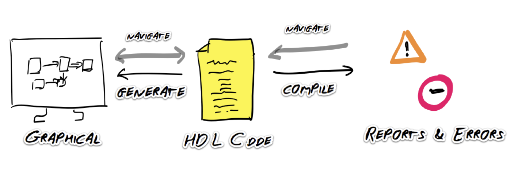

## Introduction

Historically, all electronics design was based on graphics. I remember hand-painting PCBs in High School and etching them in a FeCl3 solution. Lucky, I never had to draw individual transistors and masks sets in india ink. That time has long past as integrated circuits have become too complex to design one transistor at a time. Still, the concept that electronic circuits have to be visualized has somehow survived, long after the complexity of the largest ICs has surpassed what a single human brain can grasp.

Graphical design entry for VLSI design is dead. Or at least, it has no future.
Sigasi’s vision is to drop graphic design entry in favor of text based design entry. This requires two things: (1) an easy way to type and edit designs in a text based way, and (2) graphic views that visualize the design.

## Overview of graphical programming

Graphical programming comes in many different flavors:
* **Dataflow** based (like NI LabVIEW)
* **One-dimensional** graphical programs look and read like a traditional imperative, event driven program. The difference is that the programmer drags and connects statement blocks instead of typing statements. This is often used in educational settings, like Scratch or Google blockly.
* **Behavioral** (state-machines) visual programming is not a mainstream technique, except perhaps in digital circuit design.
In Structural visual programming, the design contains boxes and specifies through which channels they can communicate. Useful in high-level software systems architecture, and for designing digital circuits from reusable components.
* Bringing all of this together, there are various forms of **hybrid** programming. In a structural visualization, the designer can open one module and design the dataflow of that module. Mentor Graphics HDL Designer or Visual Elite is an example of a tool that supports hybrid programming.

Graphical programming (or visual programming) is very popular in several niches.
* educational and non-programmer tools, like MIT’s Scratch and Google Blockly
* flow-based: audio, video, measurement data
* formal behavior (FSMs)
* graphical design (GUI, games, ...)
* database and data layout design
* and some domain specific sub-niches

## Graphical design entry for electronics

Some good reasons for visualizing a complex design exist:
* **Inspection**: People unfamiliar with a complex design can get a general idea of how the design works, in a short amount of time. 
* **Navigation**: Designers who are debugging or working on improvements can get to the correct file faster. They don’t need to memorize file names or directory structure. Instead they can click in graphic representations to navigate to the correct code.
* **Documentation**: Documentation is useful for understanding a design, and for reviewing its correctness. It is also required for various certification authorities.
Graphics serve a purpose as a means of communication. They exist to get a point across. Often

## Disadvantages of graphical design entry
There are several disadvantages to graphical design entry for VLSI design. 

**Data format**: There is no standard data format for graphical design entry, so all of your data is locked in to your vendor’s tools. 
Scalability: While it is easy to convey a simple design in a visual way, things get out of control very easily. Likewise, it is not practical to manually draw a large number of lines between two modules. When the graphical element is your way of expressing yourself, you cannot leave out the messy details. You have to account for everything, even though a more limited visual representation might bring your point across better to another human. 

**Debugging**: After generating HDL code from your design, all of the EDA tools (simulators, code rule checkers, synthesis,...) work from that generated code. Any feedback from those tools will refer to the generated code, and not to the nice drawing you have made. You will need to make the extra step from code back to your visual design before you can fix any problems.

**Manageability**: Given the binary or XML based data formats, it is difficult to compare two versions of a design, and in general it is difficult to track your design using a standard revision control system.
Manual Layout: Much of the time needed for graphical design entry is not spent on the actual design, but on placing objects on the screen, making them look nice. This is a tremendous waste, since the placement on screen has no correlation whatsoever with the final design. Computers just don’t care about aestethics. Still, for many people it is hard to resist the temptation of nicely placing all elements in an orderly fashion.

## Best of both worlds: Graphical View

So, what if you want all the benefits of visuals (inspection, navigation, documentation) without the aforementioned disadvantages? You have all of this if you use a graphical view.

The graphical view provides graphics that are:

**Automatically generated**  There is no “generate” button, and you don’t need to open a file in a separate tool. The graphics are always there and they are always up to date. 

**Cross linked** If you click on an item in the graphic view, you can jump to the code that relates to that item. Conversely, while you are editing code, the corresponding part in the view can be highlighted in the view.

**Stateless** The fact that a Graphical View is stateless implies that you cannot move elements around. You don’t want vendor proprietary files to store the graphics information, so the placement of elements is out of your hands. While this may sound as a disadvantage, it really isn’t. Placement algorithms should provide a reasonable placement on the screen. While you are programming you can probably live with this placement, even if your ideal placement is a bit different. Once you start working on your documentation, you can export the drawing in a vector format and edit it in a separate drawing program.

## Summary

To conclude, graphic editing poses several problems, including scalability and manageability problems. These problems are addressed when design teams switch to language-based design entry with graphical views. 
Sigasi is working on this vision and finding followers (and customers) among teams who formerly used graphical design entry tools.

