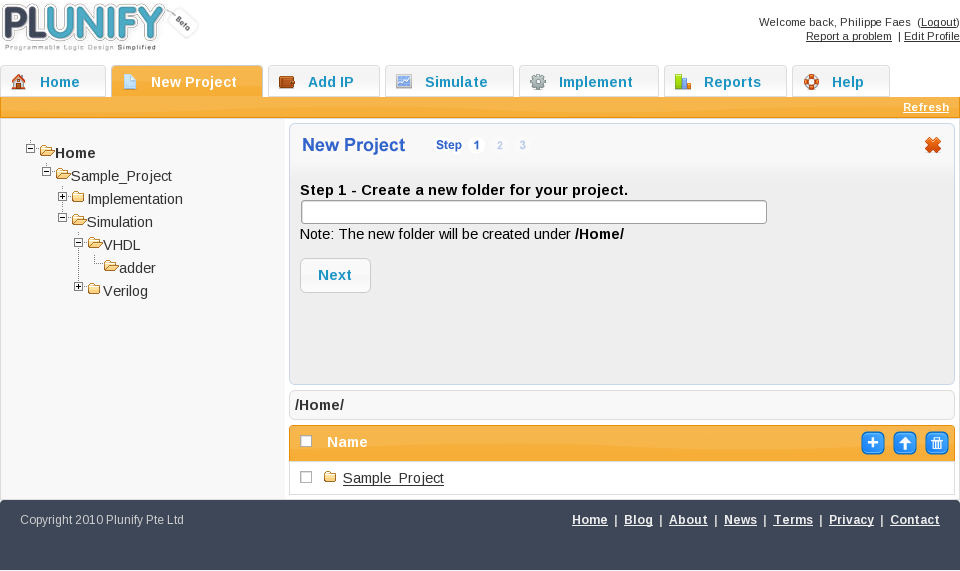

Last week was the first time I heard about <a href="http://www.plunify.com">Plunify</a>. If I may over simplify, their product is to EDA what Hotmail and Google are to e-mail. They provide a single web 2.0 based interface to an entire tool chain for FPGA design. In the back-end, they run the simulation and synthesis tools from Xilinx and Altera. But the user only sees a single interface. 

I had a short skype call with Kirvy and Harnhua, the Plunify founders. It turns out they only published their website two months ago, but they have been <a href="http://plunify.blogspot.com/">blogging</a> for a while.

Their website states you can "Start designing in 5 minutes." That's impressive. Downloading and installing even the simplest software would probably not be feasible in 5 minutes, let alone getting a project set up and actually doing some coding. 

I've signed up and it does feel very nice. (Except for the <a href="http://twitter.com/trondd/status/21646730081">lack of a good editor</a>, of course ;-)

The Plunify baseline is: <em>Because you should spend time on your design, not on your design tools.</em> I'm sure that sounds familiar to many hardware designers. It is also an important characteristic of <a href="/tag/eda2.0/">EDA 2.0</a> companies that they want to radically improve the user experience.

Another characteristic is that EDA 2.0 companies have a radically different pricing policy from traditional EDA companies. (Yes, <em>different</em> means <em>lower</em> in this context.) Plunify hasn't published any prices yet, so we'll all have to wait and see what happens. Since they are clearly aiming for the FPGA market, I'm confident that their price point will be FPGA-friendly, so to speak.

