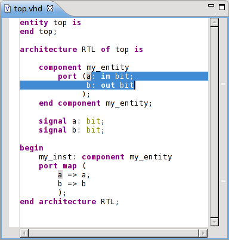
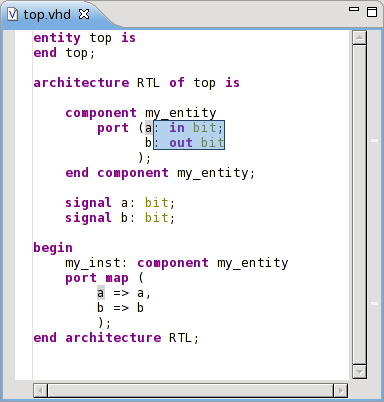

One of the most frequently asked questions we get is :

> Does Sigasi support block selection (a.k.a. column selection) mode?.

In this blog post I question the need for this feature since there is a more powerful alternative in most use cases.

## What is block selection mode?
Block selection is an alternative for standard (paragraph) selection. Standard selection is what everybody knows and it is ideal for selecting lines of text or paragraphs. Block selection mode differs from standard selection mode in that it allows to select rectangular regions.  Block selection is ideal for selecting vertical regions, e.g. a column of a table or all port names in a port map.




## Why would one use block selection?
Block selection can speed up certain edits when working with VHDL such as component instantiations and case statements.

Because the code to declare a component and to instantiate a component are so similar, it would be a waste of time to type the component instantiation from scratch when you have already have typed the component declaration.

Example declaration:
```vhdl
component my_entity
   port (a: in bit;
         b: out bit
        );
end component my_entity;
```

Example instantiation:
```vhdl
my_inst: component my_entity
   port map (a => a,
             b => b
	    );
```

A better way to do this is to:
<ol>
    <li> copy the component declaration</li>
    <li> add a label at the begining</li>
    <li> replace "port' with "port map"</li>
    <li> use block selection to select everything at the right of the colons</li>
    <li> type the name of the signals you want to connect to the ports (and to forget to use colon instead of semicolon)</li>
</ol>

The only precondition for this approach to work is that you always vertically align all port declaration.

Another example is entering a case statement based on an enumeration type where you can use block select to add the "when" and "=>" keywords on all lines at the same time.

Example enum type:
```vhdl
type my_state_type is (test1,test2,test3);
signal state : my_state_type;
```

Example case statement:
```vhdl
case state is
  when test1  => null;
  when test2  => null;
  when test3  => null;
end case;
```

## Do you really need block selection in VHDL?

Apparently you only need block selection to speed up typing some code constructs. In Sigasi HDT, there is another mechanism to speed up this task: **autocomplete**. With autocomplete you can type a component instantiation based on a component declaration a lot faster without copy/paste.
For the case statement example we could implement a similar template.

So my conclusion is that autocomplete will pre-empt block selection mode in the near future. Nevertheless to make the learning curve of HDT even smoother, I am working on integrating block selection in our tool and give a choice to the end user.

## Update

Sigasi does have [/screencasts/block_selection_mode].