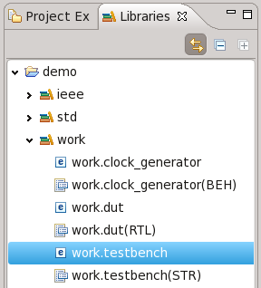
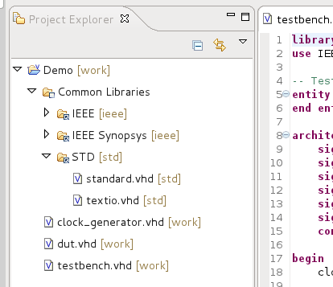

# Introduction

HDL libraries are a very powerful feature of the HDL languages. Sigasi Studio
makes it easy to configure and use them. In this chapter, we assume that
the basic concepts of HDL libraries are understood. We will explain how
they are implemented in Sigasi Studio.

Like with any HDL tool, Sigasi Studio needs to know where the libraries are
located on the file system. We will describe how the library
configuration can be examined and modified using the GUI.

We will also present some use case about how to set up libraries with
Sigasi Studio to organize your projects.

# Examining the library configuration {: #libraries-examine}

You can examine the library configuration in the [/manual/views#libraries]
and in the [/manual/views#explorer]
view. The Libraries view shows how
*design units* are mapped. The Project Explorer view show how VHDL or
SystemVerilog *files* are mapped.

In the Libraries view you can see a tree of all libraries in your
projects. You can open each library to see all contained design units.

In the Project Explorer view each physical file or folder is annotated
with the library it belongs to, between square brackets:

What you see here is the initial library mapping of a demo project (you
can create such a project by selecting **File \> New \> Other \> Tutorial
VHDL Project** or **Tutorial SystemVerilog Project**).  
In the screenshot we see a project called Demo, with a folder named
`Common Libraries`. In that folder, you see the typical standard
libraries (`std` and `ieee`) upon which all VHDL projects depend. The
demo project itself consists of a few VHDL files.

Next to the project’s name `Demo`, is the annotation `work`. This means
that, barring any overrides, everything in the project will be stored
inside the `work` library.

Lower down, we see overrides. For example, the `STD` folder has an
annotation `std`. This means that, again barring any further overrides,
the entire contents of the `STD` folder will be mapped into the library
`std`. There are no limits to the number of overrides that can be
performed. If this needed, any individual file can be mapped to a
separate library.

# Modifying the library configuration {: #libraries-mapping}

The library mapping for project files can be modified in the Libraries
and Project Explorer view.

Select a file or a folder in the Project Explorer and right-click.

You get a `Set Library` context menu, with a number of options:

* Select **Exclude from build** to exclude the file or folder from any library
* Select **New Library...** to define a new library and map the file or folder to it
* If one ore more folders are selected, the folder can be added to a library with the folder name(s)
* Select the name of an existing library to map the file or folder to that library

When you map a file into a library, only that file is affected. However,
when you map a folder into a library, then everything in that folder
will be mapped into that library. Any overrides in the folder and its
sub-folders will be removed. When you are defining the library mapping
for a new project you should map from top to bottom.

So in the case of our `Demo` project, you would change (if `work` is not
a good default) the top folder’s mapping first and then override the
mapping in the sub-folders.

When you are changing the library mapping of a project, the project will
be rebuilt completely. In order to *avoid several consecutive rebuilds*
while you are setting up your libraries, you can temporarily disable the
automatic rebuilds, until you are finished setting up your library
mappings. You can do this by disabling the **Project \> Build
Automatically** option.

To exclude a file from all libraries, the library mapping context menu
provides an `Exclude from build` option. You can apply that to any file or folder in
the project. Sigasi Studio will then assume that the corresponding resource is
not a part of the project and will not include that resource in a
project build. This is typically useful when you have stale copies of
HDL files or folders lying around that you want simply to be ignored.

# Configuration file

All library configuration information is stored in the `.library_mapping.xml`
file in the root of your project.
If you edit this file, your project will be cleared and rebuilt automatically
(a so-called *Clean Build*).

Sigasi Studio only writes changes to this configuration file when you make
changes to the library configuration with the context menu in the
*Project Explorer*.
When you do make changes, Sigasi Studio first checks that all paths in the
library configuration still exist. If a path no longer exists, is will be
removed from the configuration file.
Note that the library configuration file is **case-sensitive**, even on Windows.

# Common Libraries {: #libraries-common}

In any newly created VHDL project, the `Common Libraries` folder
contains the VHDL files of the `IEEE` and `STD` libraries. This folder
is special in the sense that its contents are not stored in regular files
on your hard drive. Instead, the files’ contents are shipped as part of
the Sigasi Studio installation. These files are not sent to an
external compiler since it is expected that the contents of the Common Libraries
are pre-compiled. Other than that, the `Common Libraries` folder
behaves like any other folder. You can delete it, rename it, and apply a
different library mapping. In most cases, however, the default
configuration is just what you need.

If you have modified the `Common Libraries` folder, you can always
revert it back to the original state.
Right-click on your project in the explorer view and apply menu-entry
**Reset Common Libraries**.

# IEEE Vital

See [/tech/how-can-i-use-the-ieee-vital-libraries-with-sigasi-pro]

# Shared libraries

Sigasi Studio allows you to share libraries between multiple projects. The
easiest way to do this, is to develop each library in a separate project
and configure the **Project Dependencies** accordingly. To configure the
project dependencies, right click the project (the one that uses the
shared library) and select **Properties**. Next click **Project
References** and mark the library project as referenced project.

# Using third party libraries {: #libraries-third-party}

Many projects use third party libraries. These can be added to the
project as any other set of VHDL files.

A number of popular third party libraries are the following:

Vendor   | Library           | Install dir example
-------- | ----------------- | ----------------------------------------------------
Xilinx   | `unisim`          | `C:\Xilinx\14.4\ISE_DS\ISE\vhdl\src\unisims`
Xilinx   | `XilinxCoreLib`   | `C:\Xilinx\14.4\ISE_DS\ISE\vhdl\src\XilinxCoreLib`
Xilinx   | `simprim`         | `C:\Xilinx\14.4\ISE_DS\ISE\vhdl\src\simprims`
Altera   | `altera_mf`       | `C:\altera\12.1\quartus\libraries\vhdl`
Mentor   | `modelsim_lib`    | `${ModelSimPath}\vhdl_src\modelsim_lib`

On Linux the default installation location for Xilinx is `/opt/Xilinx`
and `/opt/altera` for Altera.

For many common third party libraries, you can set up the library using
a [/manual/linting#Quick Fix for third party libraries].

## XilinxCoreLib

XilinxCoreLib is a very big library with more than a thousand entities and architectures. If you include all of these design units, it slows down the compilation phase of Sigasi Studio. In order to avoid that, Sigasi Studio only adds the packages with the component declarations to your project by default. It *excludes* the entities and architectures *from compilation*.

You can easily add selected entities (and architectures) to your project by right clicking the corresponding file (`filename = entity name.vhd`) in the [Project Explorer][/manual/views#explorer], and selecting **Set Library > xilinxcorelib**.

# Library errors from external compilers

If you are using the [/manual/tools#External Compilers], the external compiler can also put error markers on library clauses. You can easily
verify this by checking the prefix of the error message (e.g. `vcom:` for vcom errors). Consult the [/manual/tools#Libraries] section of the external compiler integration for more information on configuring libraries for your external compiler.
