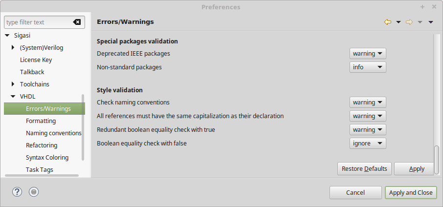
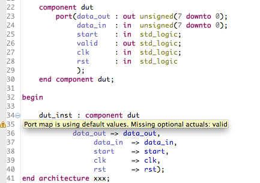
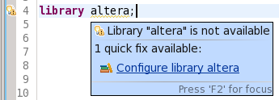

[vhdl_only]

In addition to syntax validation, Sigasi also checks your code for
semantic problems (**Linting**, or **Linter checks**). Some of these
problems can be automatically resolved with **Quickfixes**. Both syntax
checking and linting happen at type-time: new markers appear *as you are
typing* your code.

# Marker Icons {#linting-icons}

-    marks an info message.
-    marks a warning that can be resolved automatically with a quickfix.
-    marks a warning that cannot be resolved automatically.
-    marks an error that can be resolved automatically with a quick fix.
-    marks an error that cannot be resolved automatically.

# Linting {#linting-linting}

VHDL code **Lint** is defined as code that is strictly correct according
to the language definition, but still suspicious or problematic.
Sigasi has a built-in VHDL linter, which provides info about code lint
in the design. Sigasi’s VHDL linter checks for the following problems:

-   Unused declarations
-   Duplicate declarations
-   Declaration could not be found
-   VHDL 2008 features in VHDL 93 mode (Learn about [/manual/config#configure-vhdl-version])
-   Assignment validation
-   Case statement validation
-   Instantiation statement validation
-   Library validation
-   Range validation
-   Deprecated and non-standard packages
-   Duplicate, conflicting design unit names
-   Missing return statement in function bodies
-   Missing, unnecessary and duplicate signals in the sensitivity list
-   Port, signal, variable, constant or generic declarations that are
    never read or written

## No Linting for Common Libraries {#linting-common-libraries}

Common Libraries are considered to be production ready libraries.
Linting is skipped for all files in the Common Libraries folder.

## Quickfixes {#linting-quickfix}

Some of the VHDL lint problems can be automatically resolved with
*quickfixes*. These problems have *markers* annotated with a lightbulb
icon (like ). To trigger
a quickfix, click the problem marker or press **Ctrl-1** and select the
quickfix.

-   Remove unused declaration
-   Declare signals
-   Switch to VHDL 2008 mode
-   Correct signal/variable assignment operator
-   Ignore deprecated libraries
-   Configure Altera, Xilinx and ModelSim libraries
-   Declare missing enumeration literal in case statements
-   Add missing when clause in case statements
-   Correct attribute entity class in attribute specifications
-   Add missing signals to sensitivity list
-   Fix capitalization of identifier to correspond to its declaration

## Configuring the Severity Level {#linting-severity-level}

The Sigasi VHDL linter has reasonable defaults for the severity level of
reported lint problems. However, the severity level of certain classes
of lint is configurable for additional flexibility. The configuration
interface is available in **Window \> Preferences \> VHDL \>
Errors/Warnings**.



## Creating Custom VHDL Linter Rules {#linting-custom-rules}

At this time, most linting rules are not user-configurable. We will be happy
to work with you on implementing your own custom linting rules and
coding style rules. 
Discover more about [customer linting rules](http://www.sigasi.com/custom-linting).

If your company has a set of coding rule and you need tool support, we
can implement your coding rules at minimal cost. [Read more](http://www.sigasi.com/vhdl-lint)
and contact us to discuss your requirements.


### Basic VHDL coding rules

[creator_only]

-   NULL\_RANGE\_ERROR [link](#null-range)
-   DEPRECATED\_PACKAGE [link](#deprecated-ieee-packages-non-standard-packages)
    <!--* REDUNDANT_CHOICES -->
-   REDUNDANT\_OTHERS [link](#redundant-others)

-   Subprograms in packages (e.g. function body in a package, rather than in the package body)
-   Infinite loops in simulations:
    -   INFINTE\_LOOP\_STATEMENT
    -   PROCESS\_WITHOUT\_SENSITIVITY\_AND\_WAIT
-   NUMERIC\_LITERAL\_WHITESPACE\_BEFORE\_UNIT [link](#space-physical-unit)
-   SUPERFLUOUS\_LIBRARY [link](#/manual/superfluous-library-clause)
    <!-- * MISSING_LIBRARY -->
-   UNUSED\_DECLARATION: PORT, GENERIC, SIGNAL, ...  [link](#dead-code-lint)
    <!--* BITSTRING_STD_LOGIC: invalid characters in bit string-->
-   SENSITIVITY\_LIST [link](#sensitivity-list)

### Advanced VHDL coding rules

[xl_only]

-   FSM\_DEAD\_STATE
-   DEAD\_CODE (unreachable statements) [link](#dead-code)
-   NEVER\_WRITTEN / NEVER\_READs
-   NAMING\_CONVENTIONS
-   INCOMPLETE\_ASSOCIATIVE\_OPTIONAL [link](#incomplete-port-maps-and-generic-maps)
-   POSITIONAL_ASSOCIATION_IN_INSTANTIATIONS [link](#posititional-association-in-instantiations)
-   CASE_REFERENCES [link](#capitalization-of-identifiers)

# List of VHDL code rules

This is the list of VHDL coding rules that can be checked automatically
by Sigasi.

### Dead Code lint {#dead-code}

Dead code is code that is does have any effect in your simulation or
synthesis. Examples of dead code are signals that are never used, or
conditions that are never triggered.

Dead code does not bother the simulator nor the synthesis tool. However,
it consumes mental energy of anybody reading the code. People will try
to figure the puropose of a given statement and it may take a while
before they realize that they are dealing with dead code. This makes it
more expensive to review code and to reuse code. In general, dead code
is a form of technological debt that should be avoided.

Sigasi Studio flags some kinds of dead code:

-   unused or unnecessary library and use clauses,
-   unused declarations (signals, constants, …)
-   unused ports
-   unreachable statements

For unused declarations, there is also a quickfix to help you remove
unused declarations fast.

### Deprecated IEEE Packages, Non-Standard Packages

Some packages are widely spread, but were never standardized by IEEE.
Different vendors have shipped different versions, with incompatible
implementation. These packages should not be used and are flagged as
**Deprecated IEEE packages**.

```vhdl
ieee.std_logic_arith
ieee.std_logic_signed
ieee.std_logic_unsigned
```

Instead, use the standard `ieee.numeric_std` package.

The package `ieee.std_logic_misc` has the same problem of not being standardized by IEEE. Contrary to the packages above, there is no consensus on how to replace this package.  
Sigasi flags this package as **Non-standard package**.

Read more in [/tech/deprecated-ieee-libraries].

### Incomplete Port Maps and Generic Maps

Available since Sigasi 2.25

Sigasi warns about port maps and generic maps that are not complete:

**Port map is using default values. Missing optional actuals: yourport**

Input ports and generics need to be be assigned in your instantiation
statement, if they don’t already have a default value. If you don’t do
this, you are writing illegal VHDL. Sigasi will mark an error, and so
will all other tools.

Input ports and generics with a default value, as well as output ports
do not need to be assigned explicitly. However, this is often not
intended. For that reason, Sigasi can warn you about this.



### Posititional Association in Instantiations

Available since Sigasi 2.30

Most VHDL designers prefer named associations in port and generic maps in instantiations. This makes it a lot easier to spot wrong connections.
By default Sigasi warns when positional associations are used. You can change the severity of this check via **Preferences > Sigasi > VHDL > Errors/Warnings** in the **Instantiation statement valiadation** section.


### Quickfix for Third Party Libraries

If you are using vendor libraries from Altera or Xilinx (ISE or Vivado),
you do not need to set up these libraries by hand. Sigasi has a QuickFix
to do this for you.



The `library` statement that tries to import a missing library (like
`altera`) will be have a yellow warning marker next to it. Click this
marker and select **Configure library altera**. If the path tho your
Altera Quartus (or Xilinx ISE) installation is not yet set, Sigasi will
ask to set the path now. You can always change these paths in **Window
\> Preferences \> Sigasi \> Toolchains**.
Note that for the Xilinx libraries we only map the packages with the
component declarations. By default all entity and architecture
declarations are not mapped (excluded). This significantly reduces the
time for a clean build. If you use direct entity instantiations, you can
easily map the entities you need.

### Redundant "others"

If a case statement contains all the possible choices (usually in an
enumerated datatype), you can safely remove the “when others” clause.
Sigasi warns about this:

**Case statement contains all choices explicitly. You can safely remove
the redundant “others”.**

There is some debate on this coding rule. However, the vast majority of
synthesis tools do not take the “others” into account if all choices are
enumerated. If the synthesis tool is set up to generate fault-tolerant
hardware, the fallback state is the same as the reset state (for most
synthesis tools). Check the manual of your synthesis tools and run some
experiments. 
For more information, see [/tech/vhdl-case-statements-can-do-without-others]

### Sensitivity List

VHDL requires a sensitivity list for each process (or wait statements in
the project).

Since VHDL-2008, you can write `process (all)` to make sure you have all
signals in the sensitivity list. In all earlier versions, incomplete
sensitivity lists can cause unexpected behavior. That is: your
simulation results may be different from your synthesis results. Most
synthesis tools ignore your sensitivity list. In traditional workflows,
only the synthesis warnings will give you a hint that your sensitivity
list is incomplete. This report will be available only hours or even
days after you have finished typing your code. Flagging this problem
earlier saves time and lets you catch the problem early.

Sigasi can warn about problems with your sensitivity list:

-   **Incomplete sensitivity list** (there is quickfix for this)
-   **Superfluous signals in sensitivity list**
-   **Duplicate signals in sensitivity list**

### Superfluous Library Clause

The VHDL language reference manual states that:

<em>Every design unit except package STANDARD is assumed to contain the
following implicit context items as part of its context clause:</em>

```vhdl
	library STD, WORK;
	use STD.STANDARD.all;
```

Hence, any extra library statement that includes `STD` or `WORK` is
pointless, as is any use clause that includes `std.standard.all`. Hardly
anybody would type the use clause, but quite some people start all of
their files with two extra library clauses. Sigasi flags this as
warning.


### Dead Code (unreachable code)

If the Sigasi analyser can determine that a condition is always false,
it will mark the if-statement because it contains dead code.


### Null Range (empty range) (#nullRange)

In VHDL, you can use ranges with `to` and `downto`. But, if you use the
wrong direction, you get an empty range, which is usually not what you
want: `7 downto 0` is a range of eight. `7 to 0` is an null range.
We have a lint check that warns about this, even if you use constants
(or some simple arithmetic).


### Space Before the Physical Unit

If you type a numeric literal with a physical unit, there should be a
space between the number and the unit.

```vhdl
	T := 25ns; -- ILLEGAL, but accepted by ModelSim
	T := 25 ns; -- OK; according to VHDL language standard
```

Mentor Graphics’ ModelSim and QuestaSim accept the former (illegal)
version. As a result, some VHDL designers got used to writing the
incorrect version, producing code that is not portable to other
simulators. Sigasi accepts the ModelSim-style physical literals, but
warns about this.

### Capitalization of Identifiers

Although VHDL is not case sensitive, it is recommend to always use the same capitalization when referring to the same declaration. Since version 2.30, Sigasi warns when the capitalization of a reference differs from the capitalization of the declaration. Because external libraries can have different code styles, this linting only checks references in the same library as its declaration.

Since [/releasenotes/sigasi-2.31] this can easily be fixed with a quickfix.


### Naming Conventions

On the **Navigation conventions** preference page (**Window \>
Preferences \> Sigasi \> VHDL \> Naming conventions**) you can configure
patterns to check correct naming of your VHDL identifiers. Patterns are
configured with [Java regex
syntax](http://www.vogella.com/tutorials/JavaRegularExpressions/article.html)

Only name with a specified pattern are checked. Empty patterns are
omitted.

**Example:** to enforce a style where all variables have a `_v` suffix,
you whould specify `.*_v` pattern in the **Variable name** field.


### Vector width in assignments and port maps 

Sigasi checks the vector size in assignments (Since [/releasenotes/sigasi-2.28]) and port maps (Since [/releasenotes/sigasi-3.01]). This check works at type-time and takes the (symbolic) value of generics into account.
 


## Project specific Linting settings

The default way to configure the severity of the Sigasi linting checks is to set their severity in the **Errors/Warnings** preference page.
You can override these setting by creating a settings file for your projects. 

In each project, you can override the coding rules settings. You can override rules for the **entire project**, for **folders** in the project, or for individual **files**.

Project settings are stored in this settings file:

	${project location}/.settings/com.sigasi.hdt.vhdl.linting.prefs

To configure the severity of validations, add a line for each validation:

	${validation id}/severity/${path}=${severity}

Where `${validation id}` can be

* the number of the validation ID (e.g. 140)
* `all` to specify all validation ids in one rule

Where `${path}` can be:

* `<project>` (literally, with brackets!)  to set the severity of the entire project
* `/path/to/folder` to set the severity of an entire folder
* `/path/to/file.vhd` to set the severity of a specific file

Where `${severity}` can be:

* ERROR
* WARNING 
* INFO 
* IGNORE 

Whitespace must be escaped with a back slash (`\`)

Examples:

	72/severity/<project>=IGNORE
	72/severity//Folder\ name/Extra\ folder=INFO
	72/severity//test/top.vhd=WARNING
	all/severity/<project>=IGNORE

### Validation IDs

|Validation ID|Description|
|-------------|-----------|
| 50 | Library is not available|
| 64 | Duplicate design units|
| 84 | Report encrypted files|
|  8 | Deprecated IEEE packages|
| 37 | Non-standard packages|
| 38 | A process must either have a sensitivity list or contain one or more wait statements|
| 47 | There has to be a whitespace before physical units|
| 49 | Superfluous library clause|
| 55 | Find unused declarations|
| 57 | Bitstrings may only contain std_logic metavalues|
| 67 | Find unused ports|
| 68 | Find unused generics|
| 72 | Find incomplete sensitivity lists|
| 73 | Find superfluous signals in sensitivity lists|
| 85 | Find duplicate signals in sensitivity lists|
|  1 | Null range: The left argument is strictly larger than the right|
| 12 | Case alternative contains redundant choices|
| 13 | Case statement contains all choices explicitly. You can safely remove the redundant 'others'|
| 20 | Infinite loop. Loop is missing a wait|
| 26 | Null range: The left argument is strictly smaller than the right|
| 48 | Unbound component instantiations|
| 71 | Find dead states in state machines|
| 79 | Find dead code|
| 88 | Detect signals and variables that are never written|
| 89 | Detect signals and variables that are never read|
| 92 | Check naming conventions|
| 94 | Incomplete port map or generic map|
|144 | Array assignment validation|
|163 | All references must have the same capitalization as their declaration|
|164 | Check for positional associations in instantiations|

