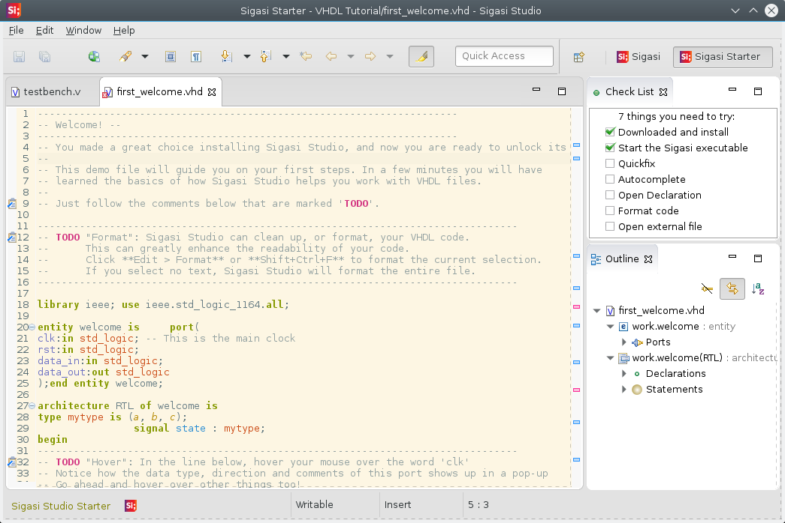
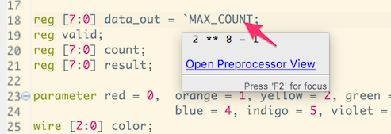
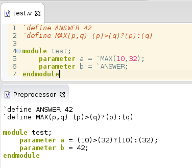
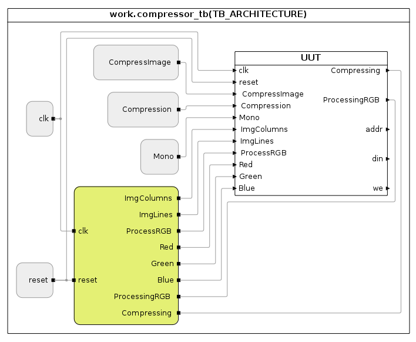
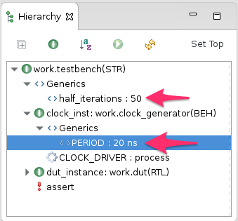
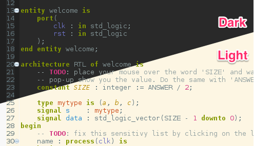

The Sigasi Studio 3.0 release brings you a rebranded HDL IDE. This release brings many improvements, especially for SystemVerilog and the Eclipse workbench.

Because this release brings major changes, carefully read the "[#How to update?]" section.

## Sigasi Studio 3: Starter, Creator and XL

The different Sigasi version (Starter, Pro and Premium) were renamed to Sigasi Studio **Starter**, **Creator** and **XL**.

We optimized Sigasi Studio **Starter** as much as possible to work with **single files**. The UI in Sigasi Studio **Starter** only show menus relevant for editing VHDL and Verilog files. 

  
Sigasi Studio **Starter** now only works with **single files**, and _not with projects_. So all features in Sigasi Studio Starter, only take information of the current file into account. So there is no longer a _project size threshold_, which tweaked some features as in Sigasi 2.

Sigasi Studio Starter works without a license key, but requires [/manual/talkback] and you need to keep your version up to date.

Sigasi Studio **Creator** is the go-to design entry tool and code browser for all your HDL projects, just like Sigasi Pro was. And Sigasi Studio XL is our flagship product, which can be further extended with addons.

### What about my current license?

Valid Sigasi 2 licenses are also valid for Sigasi Studio 3.x. If you have a valid Sigasi Pro license, all Sigasi Pro features continue to work in Sigasi 3.
  
If you are using a floating license, you need to update your [Flexnet daemon](#floating-license-updates).

## Sigasi Studio improvements

### Updated to Eclipse 4

* The toolbar now contains a global search field **[Quick Access](/manual/keyshortcuts.html#quick-access-ctrl3)**. With Quick Access you can quickly find open editors, available perspectives, views, preferences, wizards, commands, etc. Simply start typing the name of the item you wish to invoke.
  
* You can now select a **dark theme** in Sigasi: **Window > Preferences > General > appearance > Theme** 
* **Lightweight refresh on access** option. When this option is enabled, out-of-sync files will be automatically refreshed when you open an editor.  
* When you right click in an editor, you can now select **Show in > System explorer**, to select the file in the system explorer.
  
* **Word Wrap** and **automatic scroll lock** in the **Console View**
* The context menus of editor and view tabs now offer **Close Tabs to the left** (and **right**). There are also more options on what happens when there is not enough space to show tabs for all open editors. You can configure this in **Window > Preferences > General > Appearance > Visible tabs on overflow**.
  
* [And even more improvements](https://www.eclipse.org/eclipse/news/4.5/platform.php)

### Verilog and SystemVerilog improvements

We figured out an elegant way to deal with **preprocessor (Macro) directives**.
This results in major improvements in how we can offer you (System)Verilog support.

#### Verilog
* We enabled **type time syntax error reporting**  
  
* Sigasi 3.0 reports **errors in macro definitions**  
  
* In Sigasi 3.0 we implemented an convenient way to preview the result of preprocessing the active Verilog file. When you **Hover** a Verilog macro, you will see the **preprocessed** text. At the bottom of the hover you will also see a link to open the **Preprocessor View**.  
  
* The **Preprocessor (Macro) View** is another way to easily inspect the preprocessed Verilog code. It _automatically synchronizes its position and selection_ with the active editor. [documentation](/manual/editor.html#verilog-preprocessingmacros)  
  
* Verilog **include paths** can now be configured. Right click your Verilog project in the project explorere and select **Properties > Verilog Preprocessor**. Here you can enter a `;`-separated list of include paths (relative to the project folder). 
* Improved hover for `wire` and `reg`  
  

####SystemVerilog

* We also improved our SystemVerilog analyzer. Sigasi now correctly *links* `packages`, `records`, `structs`, `unions` and `enums`. This improves **Open Declaration** and **Find References**.
* Notes:
    * You can switch the [/manual/editor#Verilog version] via **Window > Preferences > Sigasi > Verilog > Verilog version**
    * We do no support *the entire SystemVerilog Syntax* yet. So if you see unexpected syntax error markers, [send-email] or [/manual/editor#disable verilog error markers].
  
### Sigasi XL Doc improvements

* Improved **Documenation View**: the documentation preview no longer flickers and scrolls to the top of your file when you edit your VHDL sources.
* Add option to open documentation view from the editor: **Show In > Documentation View**
* The **Block Diagram View** now also displays more concurrent statements. In addition to instantiation statements, the block diagram view now also show **processes**, **concurrent signal assignments** and **asserts**.

### Other new and noteworthy improvements

* We dropped Eclipse 3 support (new [requirements](/faq.html#what-are-the-system-requirements))
* The Hierarchy and Generics View are now merged. You can now inspect the values of generics and constants directly in the hierarchy view.  
  
* Added new, minimalistic perspective for **Sigasi Starter**
* Added [solarized theme](http://ethanschoonover.com/solarized) for the Sigasi editors  
  
* Added new option to **Export hierarchy as CSV**: use current toplevel in Hierarchy View as default value ([documentation](/manual/tools.html#export))
* The Mac OS X version now is a real 'App' contained in one, clean `Sigasi.app`
* The formatter now offers an option to **ignore keyword casing**
* We updated the Flexnet client. If you use a floating license, you need to [update the daemon too](#floating-license-updates).
* We added a warning if your Sigasi installation is outdated. If you use Sigasi without a commercial license, an update is required if Sigasi is older than 6 months. 
* We updated the Xtext dependency to `2.9.0`.

### Bug fixes

- ticket 3412 : Stuttering does not work in Eclipse 4
- ticket 3505 : Incorrect type error in record initialisation with multiple choices and others
- ticket 3433 : Linking error in VHDL `for generate` index
- ticket 3460 : Support comments without leading whitespace
- ticket 3483 : Clear nature settings when **Clear** button is pressed on the VHDL/Verilog preference pages
- ticket 3490 : Split long names in documentation tables
  

## How to update?

The update procedure is different for the Standalone version and for Sigasi as Eclipse plugin.

### Standalone version

To update the standalone version to Sigasi Studio 3.0, you need to perform a fresh download and replace your old installation:

0. Backup your current **Sigasi installation folder** and **Sigasi workspace folder**.
1. **[download_sigasi]** and **Unzip**.
2. **Start**. Note that during the first start, you will see the info dialog below. Click **OK**
   
3. [Re-install extra plugins](/tech/install-plugins-from-existing-installation.html)

### Plugin version

0. Check that your system meets the new [requirements](/faq.html#what-are-the-system-requirements)
1. Add the new update URL via **Window > Preferences > Install/Update > Available update sites**
2. Click the **Add...** button:
    * Name: `Sigasi`
    * Location: `http://download.sigasi.com/update/studio`
3. **OK**    
4. Install the updates via **Help > Check for Updates**

Note that we replaced the **VHDL perspective** in Sigasi 2.31 with a new **Sigasi perspective**. If the perspective was not automatically switched, you can switch via **Window > Perspective > Show Perspective > Other...**. Next select **Sigasi Starter** or **Sigasi**.

### Floating license updates

Because the FlexNet license framework was updated in Sigasi Studio, the Flexnet license **daemon** needs to be updated too. You can find the download details in "[/manual/license-key#License server setup]".

Users with a **node-locked license** do not have to perform extra actions. 
 
