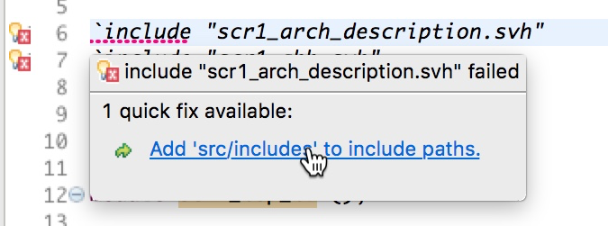
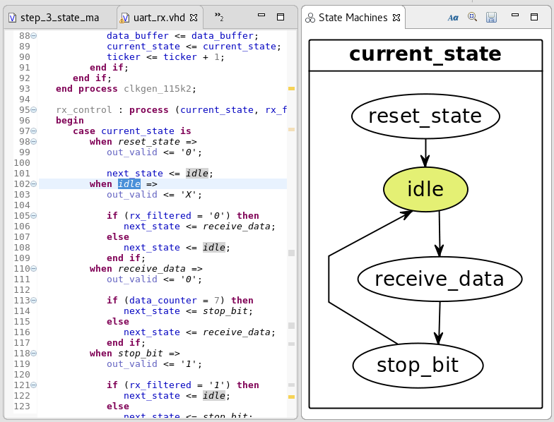

Sigasi Studio 3.5 brings full support for the **SystemVerilog** language, a frequently asked **VHDL quickfix**, a better **State Machine Viewer** and much more.

# Full SystemVerilog language support

Sigasi Studio 3.5 finally brings **full SystemVerilog support**. Providing good editing and navigation support for SystemVerilog was an _interesting technical challenge_. The _size_ and _complexity_ of the language, plus the impact of the SystemVerilog Preprocessor, proved to be a very interesting journey. We are proud to present our solution, that is both _powerful_ and requires only _very limited configuration_.

In addition to the SystemVerilog source files, Sigasi Studio only needs to know the [include paths][/manual/editor#verilog-preprocessingmacros]. Based on this information, Sigasi Studio automatically figures out in which order to analyze the files.

Sigasi Studio processes the code in a predictable order and keeps track of the preprocessor state. This also allows us to offer **full support for both SystemVerilog source files and include files**. With Sigasi Studio, you can edit include files _as if they were included in a Verilog file_. 

What SystemVerilog features does Sigasi Studio offer:

* **Syntax error feedback**: All valid SystemVerilog-2012 code should be accepted as valid code. Most syntax errors should be flagged while you type.  
   
   This works for both **SystemVerilog** _and_ **Include** files, and for both **Preprocessor** and real **SystemVerilog code**.
   
* **Preprocessor**: Sigasi Studio has a complete preprocessor. You can preview the text expansion with a **hover** or in the **Preprocessor View**.  
  
* **Include paths** can be set with a quickfix, or by right clicking a project, selecting **Properties**, and opening the **Verilog Preprocessor page**.

* **Semantic highlighting**, **Open Declaration** and **Find References**
   
* **Autocomplete** (Ctrl+Space):
    * Syntax: autocomplete for keywords and identifiers
    * Fixed Templates: these templates can be modified
    * Smart Templates: module instantiations
      
    * Preprocessor directives
      
* Integration with an **external compiler** (Riviera-Pro, ModelSim, NCsim, Onespin).
* We have a first version of SV formatting. **Clean Indentation** (**Ctrl+Shift+F**) formats the entire file in the editor.
* **Rename** refactoring  
  
* **Libraries View** gives an overview of all design units in your project.

# Improved State Machine Viewer (VHDL)

We gave the State Machine Viewer a refreshing update. We improved the looks. We have real bubbles now and transitions (edges) no longer overlap with states.
If a design file has multiple state machines, we now display all state machines next to each other (i.e. no more tabs).

If your state machine uses simple `if`-conditions for transitions, the conditions will be displayed on the transistions (if you enable the "Aa"-button).

# Other new and noteworthy improvements

* [vhdl_only] **Quickfix all undeclared signals in a port map**. This was the number one feature request for our VHDL editor. You can now declare all signals in a port map (and all constants in a generic map) in a single action  

* Improved **Libraries View**:
    - Mixed language support
    - Added action to **Set toplevel**  
      

* **Open Design Unit** dialog (**Ctrl+Shift+D**): We added an extra action to quickly open a (VHDL or SystemVerilog) design unit in an editor: hit **Ctrl+Shift+D** (or via **Navigate > Open Design unit...**), and type a pattern that matches the design unit name you're looking for  

* [vhdl_only] **Hyperlink from Entity to its architectures**. There has always been an easy way to navigate from an architecture to its entity, by **Ctrl+clicking** (**Open Declaration**) the entity name. You can now also easily navigate in the other direction with **Ctrl+click**. If an entity has multiple architectures, they will all be listed in a drop down menu  

* [vhdl_only] Better autocomplete for `configurations`
* [vhdl_only] Offer *"Declare variable"* quickfix for procedure parameters inside processes
*  \[[xl]] Better validations for `configuration`  
     
* \[[xl]] keyword autocomplete now respects the uppercase/lowercase formatting settings
* \[[xl_doc]] The block diagram view now displays the component name of component instantiations
* We updated the Eclipse Xtext dependency to `2.12.0`

# Bug fixes

As expected the old formatter had some untested "features", that the new formatter in Sigasi 3.4 didn't have.
This release brings many improvements to make the new formatter return the same results.  
Thanks a lot for all the feedback!

## Formatting bug fixes:

- ticket 3826 : Performance issues for certain VHDL constructs
- ticket 3827 : Format alignment on first parameter does not indent if a comment precedes the line
- ticket 3841 : Comments do not always break alignment blocks
- ticket 3848 : Formatting issue in `component` declarations
- ticket 3856 : Do not break **Doxygen** comments
- ticket 3857 : `transport` keyword confuses the formatter
- ticket 3858 : Formatting on first parameter with a component declaration and commented ports confuses the formatter
- ticket 3866 : Format on first parameter gets confused when declarations are grouped
- ticket 3869 : Align comments in group goes wrong
- ticket 3879 : Comments preceded by a tab break syntax on format
- ticket 3902 : Comments are not indented during format when they are before the end of an indented region

## Other bug fixes:

- ticket 3845 : \[VHDL-2008] Scoping issue with package generics in UVVM
- ticket 3019 : Entity instantiation autocomplete does not work in `generate` statements
- ticket 3895 : Avoid `NoSuchMethodError` when Sigasi is used with newer Guava versions (*Eclipse 4.6.3*)
- ticket 3884 : Scoping error with `if` condition labels in `generate` statements
- ticket 3876 : Silent exception while exporting block diagrams (project without mapped files)
- ticket 3844 : Calling QuickFix from problems view applies the changes twice
- ticket 3820 : `Case`/`for`/`else` generate show as `unknown` in Block Diagram
- ticket 3893 : SystemVerilog parse error on Properties
- ticket 3741 : One off error in Verilog macros
- ticket 3921 : Autocomplete does not work after a SL comment

## How to update?

If you have Sigasi Studio 3 installed, you can [update][update_sigasi] or [download a fresh install of the latest version][download_latest].
