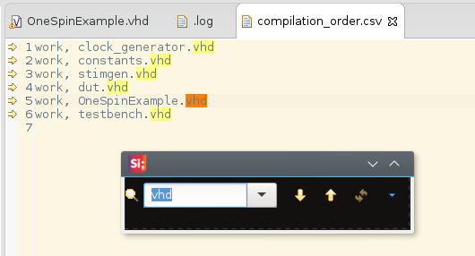

> Notepad++ highlights all textual occurrence of the currently selected identifier. Can Sigasi also do this too?

Sigasi has [*occurrence highlighting*][/manual/editor#occurrence-highlighting] enabled by default. Occurrence highlighting highlights all identifiers in your editor that refer to the same declaration as the currently selected identifier. This makes it really convenient to see where the current identifier is used.

Occurrence highlighting in VHDL and Verilog files is based on the semantics of the language, it is **not** based on the identifier's text value.
If you really want to a textual search Sigasi offers multiple options: **Edit > Find/Replace...** (**Ctrl+F**) opens a search window for the current editor. **Ctrl+J** starts an _incremental find_. **Search > Search...** (**Ctrl+H**) allows you to search for text in the entire project or workspace. When you run such a search, the search results will be shown in the **Search View**. All text occurrences will also be marked in the editor. Clearing the **Search View** removes the occurrence markers in the editor.
Note that this works for all text files/editors in Sigasi/Eclipse.

But if you are really used to the Notepad++ behaviour, you might also consider to install the [Glance Search plugin](http://ystrot.github.io/glance/). This plugins provides _incremental text search_, with highlighting.

## Install Glance plugin

* Click **Help > Install new Software...**
* Enter <http://eclipse-glance.googlecode.com/svn/site/> as update site  
  and select **Glance > Glance core** 
  
* Click **Next >** (twice), accept the license and **Finish**
* Restart Sigasi

## Use Glance plugin

To highlight all occurrence of the currently selected identifier, press **Alt+Shift+F**

You can also show the Glance Search bar permanently in the _status bar_ via the preferences: **Window > Preferences > General > Glance Search**
