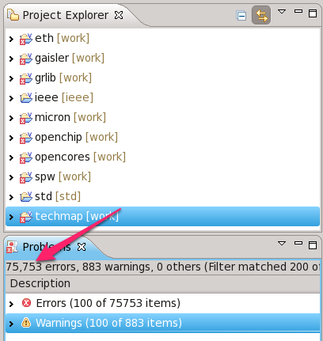
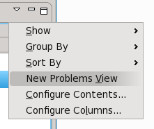
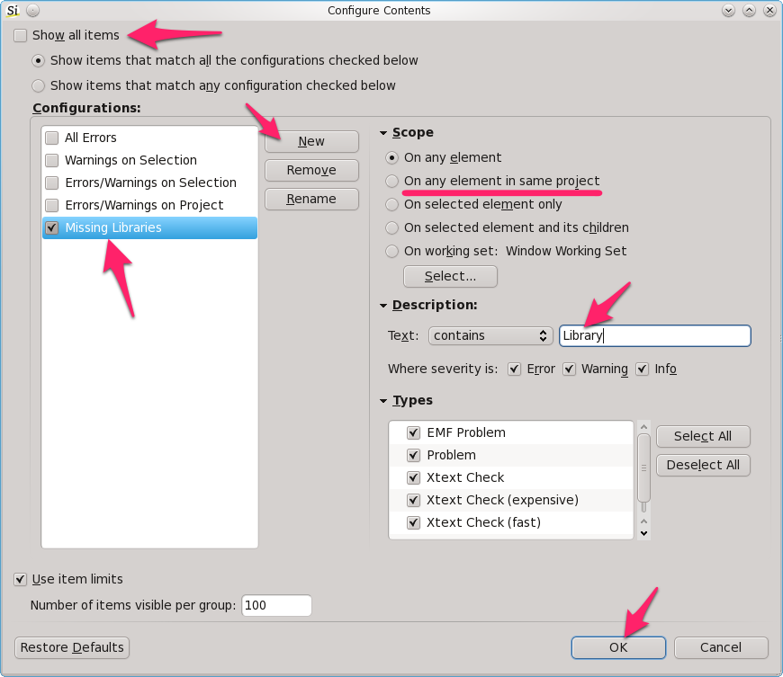

When you import a new project in Sigasi, you often get a lot of problem markers because of missing VHDL libraries. By default all project files are mapped to "library [**work**](/tech/work-not-vhdl-library.html)". VHDL libraries are defined outside of your VHDL files. So Sigasi can not configure your libraries automatically. We have some good ideas for heuristics to guess the correct library mapping. But for now, you have to configure the library mapping yourself.

But if you have many thousands of problem markers because of missing libraries. _How do you easily find out which libraries are missing?_ The easiest way is to filter the "Problems View":

1. Click the menu icon in the problems view and select *Configure Contents* 

2. In the Configure Contents dialog:
	1. _Uncheck_ "Show all items"
	2. Add a *New* Configuration and *Rename* it to "Missing Libraries"
	3. (Optionally) Click "On any element in same project" if you only want to see problems of the currently selected project.
	4. In the text field of the Description type "Library"
	5. Click OK 

You will see a lot of duplicates, but once you start mapping the libraries correctly (see [/manual/libraries#libraries-mapping]), this number will quickly decrease.

Hendrik.