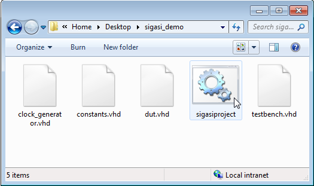

Many IDE's have a project descriptor file that you can double click to open that project. If you want your colleagues to open your project, all you need to do is make sure that they have the IDE installed, and ask them to double click the project file descriptor.

Until now, things were not that easy with Sigasi. You needed to set up a workspace and import a project. Not that much work, but still a lot more complex than just double-clicking. Until now, that is, because the latest release ([/releasenotes/sigasi-2.13]) allows you to import an open a project from the command line. We can use this feature to create a clickable script (and thus: an icon in the project directory) that will open the project.

## How to do it

First, make sure that the executable `sigasi.exe` is on your path.

Now, create a file named `sigasiproject.bat` in your Sigasi project:
```batch
sigasi.exe -p %~dp0
```

Now, you just have to **double-click** the BAT file to import and open the project in your Sigasi workspace!

Note that _importing_ does not mean that your project is copied to the workspace directory. It only means that the workspace knows that you want to work with this project.



## Linux and Mac OS X

Linux and Mac users will have no trouble translating this to their own platform. I know you guys are smart. Think along the lines of:
```bash
sigasi -p `pwd`
```

## Limitations: not officially supported

This is not an officially supported feature. I'm writing this information "as-is", hoping that it is helpful. 

Things might get complicated if you open two projects with the same name. After you are done with a project, it is best to "delete" the project from your workspace, without deleting it from your file system. That way, you can open a new project with the same name.
