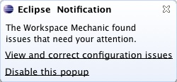

A common problem in larger teams is how to share Sigasi preferences (configuration) in design teams. There are always some options that need to be set for Sigasi to work well, for example: the simulator path, license key, custom autocomplete templates,VHDL version.

Sigasi (and the underlying Eclipse platform) does not have one single configuration file. Preferences are stored in several files. Most preferences are stored with a workspace scope and some per project. So how can you share preferences in a team?

Option 1: Corporate wiki and exporting preferences
comments: true
--------------------------------------------------

The classic approach to share preferences in teams is a Wiki or a readme file. This offers a textual description on how to setup Sigasi/Eclipse. But going through a checklist is a dull task. It is easy to make mistakes and is simply a waste of time. And what if the wiki page is updated?

Eclipse offers an import/export mechanism to share preferences in Eclipse Preference Files (.epf). This solves part of the problem. But it is still a manual task and it overwrites personal tweaks.

If you distribute a customized version of Sigasi internally, you can also set default preferences by making following changes in the Sigasi ZIP file.

1. Create a `plugin_customization.ini` file with the customized settings. E.g. following lines will hide linenumbers, use spaces for tabs and use uppercase VHDL keywords:

        com.sigasi.hdt.vhdl.Vhdl/formatting.upperCaseKeywords=true
        org.eclipse.ui.editors/lineNumberRuler=false
        org.eclipse.ui.editors/spacesForTabs=true

2. Add these two lines to the `sigasi.ini` file (before the `-vmargs`):

            -pluginCustomization
            plugin_customization.ini

Option 2: Fully automated with Workspace Mechanic
comments: true
-------------------------------------------------

Google also ran into this problem and solved it by developing the Workspace Mechanic plugin for Eclipse. This plugin, which also works fine in Sigasi, allows to automate the maintenance of Eclipse environments.

The mechanic plugin will compare your workspace configuration with the team configuration at regular intervals. If the team configuration has changed, the Workspace Mechanic plugin offers to update the local settings. The developer can choose which updates to apply, or skip, or entirely ignore.

As a small example following mechanic task will configure Sigasi to use VHDL 2008: 

	# @title Set VHDL version to VHDL 2008
	# @description Configure Sigasi to use VHDL 2008.
	# @task_type RECONCILE
	/instance/com.sigasi.hdt.vhdl.Vhdl/vhdlVersion=V08

You can install the plugin from update site http://workspacemechanic.eclipselabs.org.codespot.com/git.update/mechanic

If you need extra help using Workspace Mechanic in Sigasi, please contact us.
