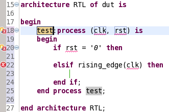
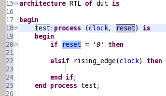
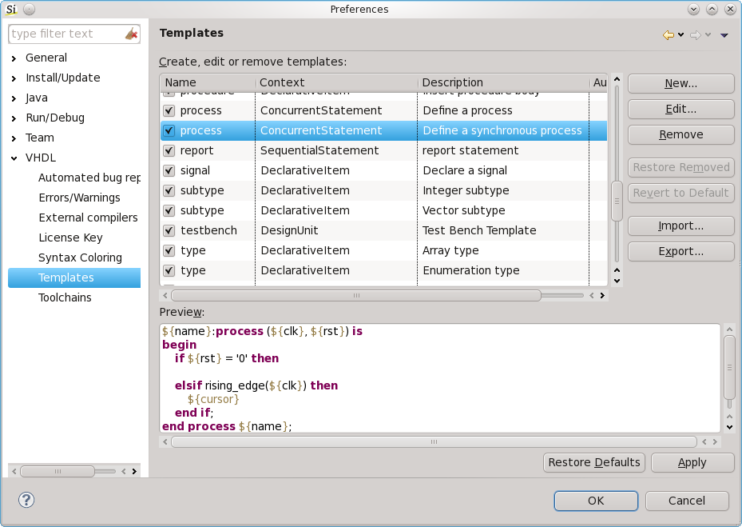

VHDL is a very *verbose language*. You have to type a lot to describe
your design and there is often a lot of redundancy in what you write.
One of the purposes of using Sigasi is to improve your productivity. So
we developed a system to automatically type code for you: **templates**.

Templates are pieces of code that occur frequently enough that you would
like to be able to insert them with a few keystrokes. Templates result
in **small fragments of reusable code that have certain pieces left open
for you to fill in**.
This might sound a bit complicated, but templates are actually *very
simple to use*. I'll show the power of templates through the use of the
built-in `process` template.

This article is the first of two blog posts about Sigasi code templates.
In this post I will explain what templates are and give an example. In
the next post I will show you how to adapt templates and how to create
custom templates.

To demonstrate the power of templates I will walk through an
autocomplete template *example* that is built-in in Sigasi: the
`process` template.

Writing a synchronous process in VHDL requires a lot of text that is
always very similar. At the same time you have to be careful not to make
any syntax mistakes. You can automate this by calling the `process`
template. Simply **start typing the name of the template**, i.e. type
`pr`, and press **Ctrl+Space**.

*Make sure your cursor is in the statements part of an architecture
(between `begin` and `end`) when you try to add the process. Sigasi's
template mechanism is **context sensitive**, so you will only be offered
templates that make sense at your current cursor position.*

You will see a list of templates starting with 'pr'. When you
double-click or select it with the **Up** or **Down** arrow keys and
press **Enter**, the template will be inserted in your code.

Once the template is inserted, you can see boxes around the process
label and the clock and reset signal. These boxes indicate template
variables that can further be edited. You can easily jump between the
boxes by pressing the **Tab** key.

If you edit the first box, the process label, you will see that the end
label (all occurrences of the same template variable are highlighted
with a background color) is updated accordingly.

In my sample `dut` entity the clock signal is called `clock` instead of
`clk` and reset is called `reset` instead of `rst`. You can easily
update the inserted code by pressing **Tab** and changing `clk` to
`clock` and another **Tab** to change `rst` to `reset`.

You can end the template editing session by pressing **Enter**. The
cursor than automatically jumps to where the small *green vertical
marker* was. When you use template autocompletion the green marker is
always at a specific position, waiting for you to press **Enter**.

To see list of all templates open **Window &gt; Preferences &gt; VHDL
&gt; Templates**. On this preference page you see a list of all
available templates. To insert one in your code just start typing its
**name** (not to be confused with its **description**). E.g. to insert
an array type, start typing `type`, and not `arra`.

In a [next post](http://www.sigasi.com/node/1753), I explain [how to modify these templates to your custom needs](http://www.sigasi.com/node/1753).
