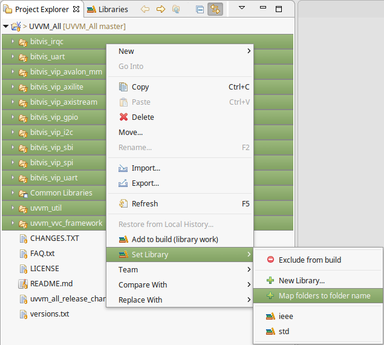

UVVM is a popular Open Source VHDL Verification Component Framework for making structured VHDL testbenches for verification of FPGA and ASIC.
When adding the [UVVM_All][UVVM_All] framework into a Sigasi project, it takes some configuration to map all files in the correct libraries.

# Installation
For this example, we'll open the UVVM_All framework in a separate project. You can also clone the UVVM_All framework into your own project and modify the steps here accordingly.

* Download the [UVVM_All][UVVM_All] framework.
* In Sigasi Studio, create a new VHDL project: **File > New > VHDL Project**, uncheck **Use default location** and **Browse...** to the location of the UVVM_All framework.
 
Once Sigasi Studio finishes building the workspace, you'll notice a lot of error messages caused by incorrect library mappings.

# Configuring the library mappings
By default Sigasi Studio maps all files to library *work*. This is not what the UVVM_All framework expects so we need to take following steps to correct the library mapping for UVVM_All.

* Make sure the VHDL version is set to 2008
    * In the Project Explorer, right click the project and select **Properties > VHDL Version**.
    * In the drop-down menu select **VHDL 2008** and press **Apply and Close**.
    * In your project, right click **Common Libraries** and select **Set Library > Reset Common Libraries**.
* Select all folders in the project, right click and choose **Set Library > Map folders to folder name**.

* Go into the *uvvm_vvc_framework* folder, right click on *src_target_dependent* and select **Exclude from build**.
* Next we need to add symbolic links to the *src_target_dependent* folder in all of the *bitvis_vip_* folders. We'll create the symbolic link once and then copy and paste it into the other folders.
    * Click and drag the *src_target_dependent* folder onto one of the **bitvis_vip_** folders while pressing the **Ctrl** key.
    * After dropping the folder the **File and Folder Operations** dialog opens. Here you set the radio button to **Link to files and folders** and make sure the link locations are created relative to **PROJECT_LOC**. Then press **OK**.  

    * You now can right click on the linked folder and select **Copy**.
    * Right click each of the remaining *bitvis_vip_* folders and select **Paste**.

# Conclusion
The UVVM framework is now mapped correctly in Sigasi Studio. There are two testbenches that can be set as toplevel and used to start a simulation.

* *bitvis_irq/tb/irqc_tb.vhd*
* *bitvis_uart/tb/uart_vvc_tb.vhd*

If you want to skip all these steps, you can also download the UVVM_All framework including project files from [where we cloned it][UVVM_All_Sigasi]. Then you can just import the existing VHDL Project.

[UVVM_All]: https://github.com/UVVM/UVVM_All
[UVVM_All_Sigasi]: https://github.com/sigasi/UVVM_All

