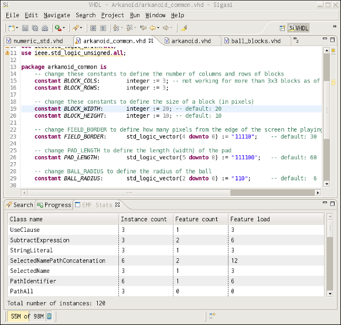

By default Xtext generates its [own ecore model](http://www.eclipse.org/Xtext/documentation/1_0_1/xtext.html#model_metamodel) from your grammar.  The [rules](http://www.eclipse.org/Xtext/documentation/1_0_1/xtext.html#metamodelInference) governing this process are not extremely complex but still can interact in surprising ways.  Such interaction for example exists when you include "alternative" grammar rules like:
```
SuperType: DerivedTypeA | DerivedTypeB;
```
then the corresponding EMF classes will be organized in an inheritance hierarchy where `SuperType` is the superclass of `DerivedTypeA` and `DerivedTypeB`.  This one inheritance relation can be influenced by other "alternative" rules, by rule actions, by enforced return types of rules ... that include some of the same types.

Another thing that may not be obvious about the generated ecore model is the exact number of instances of the model's classes in your EMF resources.  For example, the following two rules look very similar:
```
R1: A | B | C;
R2: a=A | b=B | c=C;
```

However, the resulting number of objects, once a resource is actually parsed, is quite different.  For example, suppose we have an input string that can be parsed by grammar rule `A`.  If we present that string as input to rule `R1` it will result in the production of _one_ EMF object of `EClass A`.  Rule `R2` will produce a little tree containing an EMF object of `EClass R2` with three fields, `a`, `b` and `c`.  Fields `b` and `c` will be `null` while field `a` will point to an object of `EClass A`.  

Why would you care?  "It works!  Doesn't it?".  Indeed it does.  Nevertheless, keeping your ecore model in check can be very beneficial to the overall performance of your application!  Having a messy ecore model may result in EMF classes with many more fields than you would actually need.  That will make things somewhat slower and more memory hungry.  Not to mention that the semantics of those classes becomes unclear.  More importantly, having parser rules that generate much more objects than you need will definitely slow things down noticeably and consume a lot more memory.  Not a good thing. 

In order to avoid such mishaps in the future we need to improve the visibility of the generated ecore model and the resulting resources.  Then, at least, we will be aware of the problem and can start thinking about a fix.  One way to get a better view on things is to use the "Sample Reflective Ecore Model Editor".  You get at it from **project explorer > open with > ...**.  That's a great tool to inspect your model but it does not give you the overview you need to see how "big" your model is. 

So I present to you [a few classes](https://github.com/mark-christiaens/EMF-Statistics-View) I've slapped together to help you keep an eye on things.  A picture says more than a thousand words:



[These classes, available at GitHub,](https://github.com/mark-christiaens/EMF-Statistics-View) implement a little "EMF Stats" view that shows statistics for the active (Xtext) editor.  The view shows three things:

1. _Class name_: The name of the `EClass`,
2. _Instance count_: The number of objects of this `EClass`,
3. _Feature count_: The number of features of the `EClass`,
4. _Feature load_: The product of the _instance_ and the _feature count_.

The most interesting statistic is the _instance count_.  Optimizing my grammar, I was able to reduce the total instance count by 50%.  The _feature count_ tells you which `EClass`es are "fat" i.e., contain a lot of fields.  I originally had introduced many inefficiencies in my grammar that caused `EClass`es to contain features that where not relevant.  By cleaning up, I reduced the total number of features by at least another 50%.  The impact was not as big as the _feature count_ but still noticeable.  Finally, the _feature load_ tells you which `EClass`es carry the most weight dynamically.  You can focus primarily on those with a high _feature load_ and ignore the infrequently used ones.

To finish, just a quick note about the supplied classes.  It's a standard view that needs to be enabled in your UI `plugin.xml`:

```xml
<extension
      point="org.eclipse.ui.views">
   <category
         id="com.sigasi.profiling"
         name="Profiling">
   </category>
   <view
         category="org.eclipse.xtext.viewCategory"
         class="com.sigasi.emfstats.StatsView"
         id="com.sigasi.emfstatsview"
         name="EMF Stats"
         restorable="true">
   </view>
</extension>
```

Enjoy!